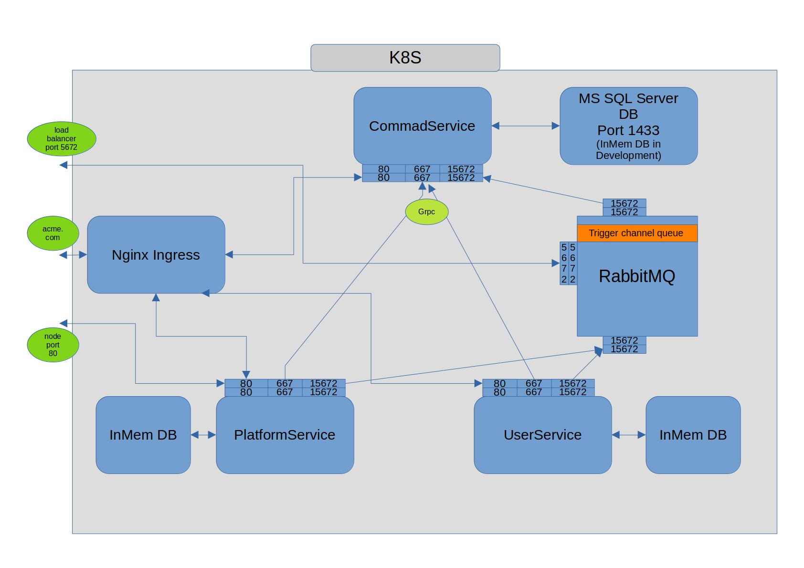

 This project implements the full introductory course presented by "Les Jackson" at https://www.youtube.com/watch?v=DgVjEo3OGBI&t=462s but it also adapts it to .net 6, since this is the current long term support .net version, and it also extends it to include an extra "UserService", that has the role of providing informations about the platforms users and making it posible for the extracted commands to be adapted based on user information.
 The diagram of the containerised services:
 
 The project has 3 services:
 - CommandService,
 - PlatformService,
 - UserService.
 The project has the following containers:
 - command service container,
 - platform service container,
 - user service containe,
 - nginx ingress service container,
 - rabbitmq asyncronous message broker container,
 - ms sql server database container (used by the platform service in production).
 
 Important aspects about the project:
 1) The platform service uses an ms sql server database in production (in K8S) and an inmemory database in development. The command and user services use an inmemory database for speeding up development.
 2) The example services are easy to run in both development local environment but you will need to either install an rabbitmq message broker locally or use the containerised version with an exit point through the asociated load balancer port(I used this one)
 3) The main idea about the whole project is to create platforms and users with their respective services and then after create commands with the command service that are asociated to diferent platforms and can be adapted based on user information (user administrative rights enspecially)
 4) The order of services startup needs to be: platform services and user services are started first and than the command service gets started after because it uses GRPC to fetch and populate initialy the list of platforms and users
 5) The project uses rabbitmq to send async messages with the newlly created platforms and users from the platform and user services to the command service. GRPC is also used to fetch the initial list of platforms and users when the command service is starting up or restarting.
 6) The project deployment files are located in the K8S folder
 7) The RestClientTests folder contains easy to run api request with the "Rest Client" extension in Visual Studio Code
 8) Don't worry about the visible passwords in the example. They aren't mine actuall passwords :P.

